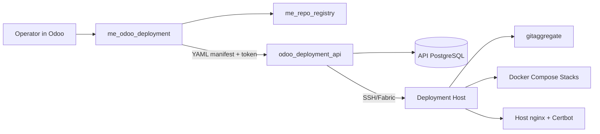

# Odoo Deployment API Showcase

This repository explains why `odoo_deployment_api` exists, what it does, how it works, and why the Odoo control plane is split from the deployment executor.

The system is a manifest-oriented deployment platform for Odoo instances. The Odoo module in `egeskov-group/me_odoo_deployment` gives operators a business-friendly UI for customers, instances, nodes, repositories, backups, and jobs. The external `odoo_deployment_api` service receives complete YAML manifests, validates them, renders Docker Compose workspaces, runs `git-aggregator`, updates nginx, and executes long-running tasks over SSH on deployment hosts.

The Deployment API is open for demos and conversations with upcoming Odoo partners who want a practical way to provision, copy, back up, restore, and redeploy Odoo environments without giving the Odoo application direct infrastructure permissions.

## System In One Sentence

Odoo describes the desired state of an instance; the Deployment API safely turns that desired state into running Docker Compose stacks on remote Ubuntu hosts.

## For Recruiters And Partners

This project shows the kind of problems I can help solve. I build backend systems, Odoo modules, deployment automation, internal tools, and platform workflows that connect business needs with production infrastructure.

What I can help with:

- design and build backend services with FastAPI, PostgreSQL, authentication, background jobs, task queues, logs, and clear API contracts
- develop Odoo modules for real business workflows, including models, views, wizards, scheduled jobs, settings, and external integrations
- automate deployments with Docker Compose, nginx, SSH, Git, Linux services, backups, restores, and environment management
- turn manual server work into reliable self-service tools for operators, customers, and support teams
- improve system architecture with better separation of concerns, security boundaries, idempotency, rollback paths, and failure handling
- connect Odoo, SaaS, ERP, and infrastructure work instead of treating them as separate worlds
- take an existing codebase through rewrites, simplification, bug fixing, testing, and operational hardening

Common roles this work maps to:

- Backend Developer
- Python Developer
- Odoo Developer
- Platform Engineer
- DevOps Engineer
- Software Engineer, Internal Tools
- Deployment Automation Engineer
- ERP Integration Developer
- Technical Lead for Odoo or SaaS operations

For recruiters, this project shows that I can take ownership of complex systems, not just individual tickets. It demonstrates practical experience with architecture, production deployment, automation, customer environment management, and business-critical Odoo workflows.

For Odoo partners, I can help with customer onboarding, staging and production environments, upgrade testing, custom addon deployment, backup/restore processes, repository management, deployment dashboards, and safer operational workflows.

For software teams, I can help with backend systems, API development, infrastructure automation, internal platforms, CI/CD-adjacent tooling, and refactoring manual processes into maintainable software.

## Repositories Involved

| Repository | Role |
| --- | --- |
| `egeskov-group/me_odoo_deployment` | Odoo 19 module. Owns UX, forms, wizards, job mirrors, customer/node/repo records, and manifest generation. |
| `odoo_deployment_api` | FastAPI execution service. Owns manifest validation, task leases, SSH execution, Docker Compose, nginx, backups, import/copy, command execution, and logs. |
| `deployment_api` | Older imperative API. Useful historical reference for why the manifest rewrite happened. |
| `egeskov-group/me_repo_registry` | Odoo-side repository registry. Tracks GitHub organizations, repositories, deploy branches, tokens, and snapshots used by deployment manifests. |

## Why The Split Matters

The Odoo module and Deployment API have different responsibilities.

| Concern | Odoo module | Deployment API |
| --- | --- | --- |
| Business UX | Yes | No |
| Customer ownership | Yes | No |
| Repository choices | Yes | Consumes manifest only |
| Manifest generation | Yes | Validates and stores |
| Docker access | No | Yes |
| SSH access | No | Yes |
| nginx writes | No | Yes |
| Long-running tasks | Mirrors state | Owns execution |
| Logs and phase output | Displays | Produces |
| Backups/import/copy | Starts jobs | Executes safely |

This keeps the Odoo database and UI away from direct root-like infrastructure access. It also makes the executor usable from CLI, HTTP clients, CI, or another future control plane.

## What The API Does

- Accepts full instance manifests through `PUT /api/instances/{name}/manifest`.
- Computes a canonical `manifest_sha` for idempotency, history, diffs, and rollback reasoning.
- Renders immutable workspaces under `/srv/doodba/{instance}/{manifest_sha}`.
- Writes `repos.yaml`, `addons.yaml`, `.env`, scripts, `Dockerfile.odoo-runtime`, and `docker-compose.yml`.
- Runs `gitaggregate` on the deployment host to assemble Odoo and addon repositories.
- Starts and updates Docker Compose projects for Odoo, PostgreSQL, and optional services.
- Updates host nginx configs, basic auth, and Let's Encrypt certificate flow.
- Tracks long-running tasks with DB-backed leases, phases, progress, logs, and errors.
- Provides operational actions: redeploy, code-only redeploy, destroy, power on/off, backup, import backup, copy instance data, status, logs, and command execution.
- Provides node verification and node manifest automation for deployment hosts.

## Why Manifest, Docker, And Git-Aggregator

### Manifest

The manifest is the contract between the Odoo module and the executor. It replaces many fragile imperative calls with one desired-state document.

Benefits:

- deterministic deployments
- diffable history
- idempotent retries
- explicit API compatibility through `manifest_version` and `min_api_version`
- easier audit trail through stored manifest YAML and SHA
- clean separation between UX and execution

### Docker Compose

Docker Compose gives each Odoo instance an isolated runtime with explicit services, volumes, ports, labels, and health checks.

Benefits:

- no per-tenant host Python virtualenv mutation
- repeatable Odoo/PostgreSQL/Redis/Mailhog stack definitions
- easier cleanup through Compose projects and labels
- safer redeploys through project names and workspace SHAs
- portable runtime expectations across deployment hosts

### Git-Aggregator

Odoo deployments often combine Odoo core, OCA repos, private addons, customer repos, branches, merge refs, and post-checkout commands. `git-aggregator` already models that problem well.

Benefits:

- one declarative checkout specification per manifest
- supports multiple remotes and merges
- fits OCA/Doodba workflows
- avoids building a custom repository aggregation engine
- keeps source assembly reproducible

## High-Level Architecture

## Typical Deployment Flow

1. Operator creates or updates an instance in Odoo.
2. Odoo generates a YAML manifest from instance fields, node inventory, proxy domains, and repo registry records.
3. Odoo submits the manifest to `odoo_deployment_api` with an idempotency key and optional `If-Match` SHA.
4. API validates the manifest and stores the manifest revision.
5. API queues a durable task and returns `202 Accepted` with `task_id`.
6. Worker connects to the target `docker_host` over SSH.
7. Worker renders and uploads the workspace.
8. Worker runs `gitaggregate` for the manifest's Git targets.
9. Worker builds or pulls the Odoo runtime image and runs `docker compose up -d --wait`.
10. Worker bootstraps or upgrades Odoo.
11. Worker syncs nginx configs and reloads nginx after validation.
12. Odoo polls `/api/tasks/bulk/`, fetches logs, and mirrors the final state.

## Minimum Runtime Requirements

For production, expect:

- Ubuntu 24.04 on API and deployment hosts
- Python 3.12+
- PostgreSQL for API state
- FastAPI/Uvicorn service managed by systemd
- Docker Engine 29+ and Docker Compose v2 on deployment hosts
- SSH from API host to deployment hosts
- `gitaggregate` installed on deployment hosts
- host nginx and Certbot for public domains and TLS
- writable deployment workspace, usually `/srv/doodba`
- protected secret directory, usually `/srv/secrets`
- API token or scoped DB-backed tokens
- Odoo 19 with `me_odoo_deployment` and `me_repo_registry` for the Odoo UX

See [Runtime Requirements](docs/runtime-requirements.md) for the detailed checklist.

## Documentation

- [Origin Story](docs/origin-story.md)
- [Architecture](docs/architecture.md)
- [Control Plane Vs Executor](docs/control-plane-vs-executor.md)
- [Manifest Contract](docs/manifest-contract.md)
- [Runtime Requirements](docs/runtime-requirements.md)
- [Deployment Flow](docs/deployment-flow.md)
- [Git History Lessons](docs/git-history-lessons.md)
- [Operational Features](docs/operational-features.md)

## Examples

- [Instance manifest](examples/instance-manifest.yaml)
- [Node manifest](examples/node-manifest.yaml)
- [Architecture diagram](diagrams/architecture.mmd)
- [Deployment sequence](diagrams/deployment-sequence.mmd)
