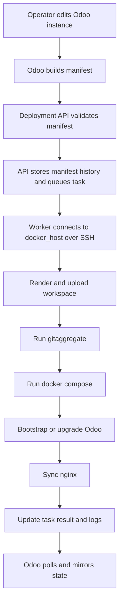

# Architecture

The deployment system has three major layers:

1. Odoo control plane
2. Deployment API executor
3. Deployment hosts

## Odoo Control Plane

The Odoo control-plane module is where operators work.

It owns:

- customer-facing deployment records
- instance purpose such as production, staging, upgrade, demo, or test
- Odoo version and edition choices
- deployment node inventory
- domain/proxy records
- repository selections from an Odoo repository registry
- backup and import wizards
- job records that mirror remote API tasks
- manifest preview and manifest history views

The module does not run Docker commands. It does not write nginx files. It does not need SSH access to deployment hosts.

## Deployment API Executor

The Deployment API is a FastAPI service with a durable task executor.

It owns:

- API authentication and scoped tokens
- manifest parsing and validation
- manifest compatibility checks
- canonical manifest SHA calculation
- manifest history storage
- task idempotency and leases
- SSH/Fabric connections
- workspace rendering
- `gitaggregate` execution
- Docker Compose lifecycle
- Odoo bootstrap and upgrade commands
- nginx config rendering and reload
- backups and imports
- copy and neutralization
- command execution
- logs and status endpoints

The API is the only layer that needs infrastructure permissions.

## Deployment Hosts

Deployment hosts are Ubuntu machines reachable from the API over SSH.

They run:

- Docker Engine
- Docker Compose v2
- host nginx
- Certbot where TLS is needed
- `gitaggregate`
- Odoo instance Compose projects
- local workspace and secret directories
- optional observability agent and WireGuard setup

Typical host paths:

| Path | Purpose |
| --- | --- |
| `/srv/doodba` | rendered instance workspaces |
| `/srv/doodba/git-cache` | shared Git cache for aggregator runs |
| `/srv/doodba/backups` | backup artifacts |
| `/srv/secrets` | files referenced by `secret://` URIs |
| `/etc/nginx/sites-available` | generated virtual hosts |
| `/etc/nginx/sites-enabled` | enabled virtual hosts |

## Data Flow

## Important Boundaries

The manifest is the boundary between Odoo and the API.

Odoo is allowed to say:

- instance name
- Odoo version
- repository refs
- addons to include
- domain names
- node choice
- ports
- runtime limits
- backup preferences

The API decides how to safely execute that desired state:

- where to render files
- how to run `gitaggregate`
- how to call Docker Compose
- how to perform bootstrap and upgrade
- how to write and validate nginx configs
- how to lock tasks and recover failures
